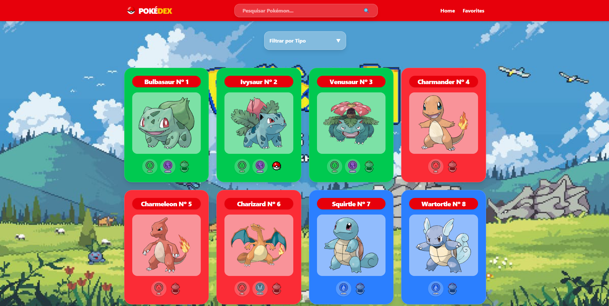
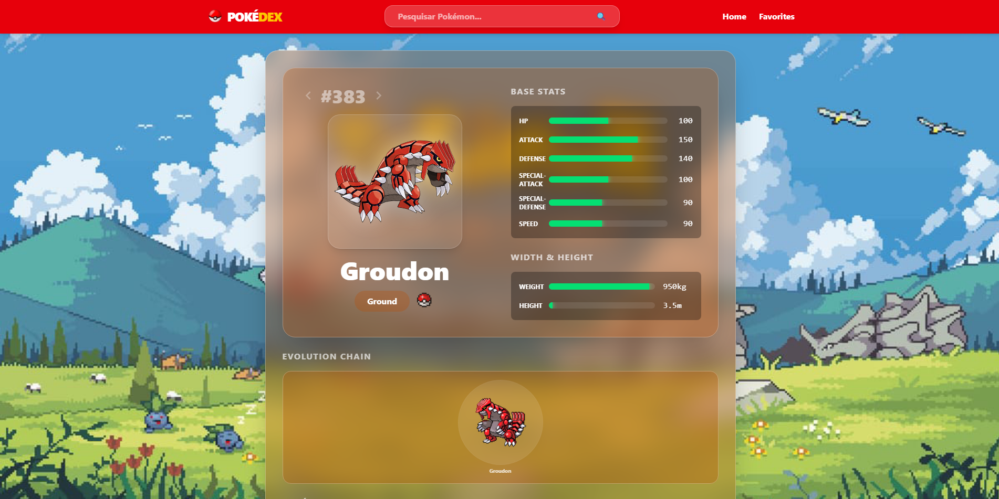

# My Project

# Contexto
Site criado com React e Vite usando a [PokeAPI](https://pokeapi.co/) como base de dados, o site mostra uma lista dos pokémons, onde você pode favoritar seus preferidos e também ver dados adicionais, como status, peso, altura.

## Técnologias usadas

Front-end:
> Desenvolvido usando: React, Context, Tailwind, HTML, ES, Vite

## Acessar o site


<a href="https://davialpiano.github.io/Poke_Dex/" target="_blank">Pokedex</a>

## Instalando Dependências
 
```bash
npm install
``` 
## Executando aplicação

* Para rodar o front-end:

  ```
    npm start
  ```

## Prints do site

* Home:



* Profile:



